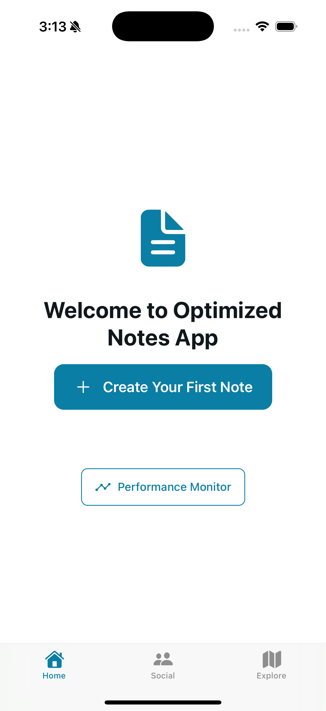

# Notes App with Authentication & Offline Capabilities

A complete React Native Notes application built with Expo that demonstrates authentication, offline functionality, and modern mobile app development practices.

## 📱 App Screenshots

### Authentication Screens

*Clean and intuitive login interface with form validation and error handling*

### Main Application

*Main notes dashboard with search, filtering, and offline status indicators*

### Note Management

*Create and edit notes with category selection and favorite toggles*

## 🟢 Current Status

✅ **Fully Functional** - All core features working
✅ **Demo Mode** - Works without backend setup
✅ **Offline Support** - Complete offline functionality
✅ **Authentication** - Login/Register working
✅ **Notes CRUD** - Create, read, update, delete notes
✅ **Search & Filter** - Find notes by text, category, favorites
✅ **Network Detection** - Real-time online/offline status
✅ **Local Storage** - Data persistence and caching

## 🚀 Quick Start

```bash
# Clone and setup
git clone <repository-url>
cd reactnativetask4
npm install
npm start

# Run on device
# Press 'i' for iOS or 'a' for Android
```

## ✨ Features

### 🔐 Authentication
- **Login Screen**: Email/password authentication with form validation
- **Register Screen**: User registration with comprehensive validation  
- **Secure Token Management**: JWT token storage and auto-login
- **Form Validation**: Real-time validation with clear error messages

### 📝 Notes Management
- **Create Notes**: Add new notes with title, content, category, and favorite status
- **Edit Notes**: Modify existing notes with full offline support
- **Delete Notes**: Remove notes with confirmation dialogs
- **Search & Filter**: Find notes by text, category, or favorite status
- **Categories**: Predefined categories (Personal, Work, Ideas, Shopping, Health, Travel, Other)

### 🌐 Offline Capabilities
- **Network Detection**: Real-time network status monitoring
- **Local Caching**: Notes stored locally for offline access
- **Offline Queue**: Operations queued when offline, synced when online
- **Seamless Sync**: Automatic synchronization when connection restored
- **Offline Indicators**: Clear visual feedback for offline state

### 🎨 User Experience
- **Professional UI**: Clean, modern design with consistent styling
- **Dark/Light Mode**: Automatic theme switching based on system preference
- **Responsive Design**: Optimized for various screen sizes
- **Loading States**: Proper loading indicators for all operations
- **Error Handling**: Comprehensive error handling with user-friendly messages

## Technical Architecture

### Project Structure
```
src/
├── components/
│   ├── common/           # Reusable UI components
│   │   ├── CustomButton.tsx
│   │   ├── CustomInput.tsx
│   │   └── NetworkStatusIndicator.tsx
│   └── forms/            # Form-specific components
├── contexts/
│   └── AuthContext.tsx   # Authentication state management
├── navigation/
│   └── AppNavigator.tsx  # Main navigation logic
├── screens/
│   ├── auth/             # Authentication screens
│   │   ├── LoginScreen.tsx
│   │   └── RegisterScreen.tsx
│   └── notes/            # Notes management screens
│       ├── NotesListScreen.tsx
│       ├── AddEditNoteScreen.tsx
│       └── NoteDetailScreen.tsx
├── services/              # Business logic and API services
│   ├── authService.ts    # Authentication operations
│   ├── notesService.ts   # Notes CRUD operations
│   ├── networkService.ts # Network status management
│   └── storageService.ts # Local storage operations
├── types/                 # TypeScript type definitions
│   └── index.ts
└── utils/                 # Utility functions
```

### Key Technologies
- **React Native**: Cross-platform mobile development
- **Expo**: Development platform and tools
- **TypeScript**: Type-safe JavaScript development
- **AsyncStorage**: Local data persistence
- **NetInfo**: Network connectivity monitoring
- **Expo Router**: File-based routing system

### State Management
- **React Context**: Global state management for authentication
- **Local State**: Component-level state for UI interactions
- **AsyncStorage**: Persistent local storage for offline data
- **Service Layer**: Centralized business logic and API calls

## 🎯 Demo & Testing

The app includes a **demo mode** that works without a backend server:

- **Mock API**: Uses JSONPlaceholder for demo data
- **No Setup Required**: Works immediately after installation
- **Full Functionality**: Test all features including offline mode
- **Real Experience**: Authentic user experience with mock data

## 🛠️ Installation & Setup

### Prerequisites
- Node.js (v16 or higher)
- npm or yarn
- Expo CLI
- iOS Simulator or Android Emulator (optional)

### Setup Steps
1. **Clone the repository**
   ```bash
   git clone <repository-url>
   cd reactnativetask4
   ```

2. **Install dependencies**
   ```bash
   npm install
   ```

3. **Start the development server**
   ```bash
   npm start
   ```

4. **Run on device/simulator**
   - Press `i` for iOS simulator
   - Press `a` for Android emulator
   - Scan QR code with Expo Go app on physical device

## ⚙️ Configuration

### Current Setup (Demo Mode)
The app is currently configured for **demo mode** using JSONPlaceholder API:

```typescript
export const API_CONFIG = {
  BASE_URL: 'https://jsonplaceholder.typicode.com', // Demo API
  ENDPOINTS: {
    LOGIN: '/users/1',      // Mock user data
    REGISTER: '/users',     // Mock user creation
    NOTES: '/posts',        // Mock notes data
    // ... other endpoints
  },
};
```

### Production Configuration
To use with your own backend, update `src/constants/api.ts`:
```typescript
export const API_CONFIG = {
  BASE_URL: 'https://your-notes-api.com/api', // Your actual API
  // ... other config
};
```

### Environment Variables
Create a `.env` file for environment-specific configuration:
```env
API_BASE_URL=https://your-api-url.com
API_TIMEOUT=10000
```

## Usage

### Authentication Flow
1. **First Launch**: App checks for existing authentication
2. **Login**: Enter email and password
3. **Registration**: Create new account with validation
4. **Auto-login**: Automatic authentication on subsequent launches

### Notes Management
1. **View Notes**: Browse all notes with search and filters
2. **Create Note**: Add new notes with title, content, and category
3. **Edit Note**: Modify existing notes with full offline support
4. **Delete Note**: Remove notes with confirmation
5. **Favorites**: Mark important notes as favorites

### Offline Usage
1. **Automatic Detection**: App detects network status changes
2. **Local Access**: View and edit cached notes offline
3. **Queue Operations**: Changes queued when offline
4. **Auto-sync**: Operations sync when connection restored

## Development

### Code Style
- **TypeScript**: Strict type checking enabled
- **ESLint**: Code quality and consistency
- **Prettier**: Code formatting (if configured)
- **Component Structure**: Functional components with hooks

### Testing
```bash
# Run tests
npm test

# Run tests with coverage
npm run test:coverage
```

### Building
```bash
# Build for production
npm run build

# Build for specific platform
npm run build:ios
npm run build:android
```

## Deployment

### Expo Build
```bash
# Build for app stores
expo build:ios
expo build:android
```

### EAS Build (Recommended)
```bash
# Install EAS CLI
npm install -g @expo/eas-cli

# Configure EAS
eas build:configure

# Build for production
eas build --platform ios
eas build --platform android
```

## Troubleshooting

### Common Issues
1. **Metro bundler issues**: Clear cache with `npx expo start --clear`
2. **Network errors**: Check API configuration and network connectivity
3. **Storage issues**: Clear app data or reinstall app
4. **Build errors**: Ensure all dependencies are properly installed

### Debug Mode
Enable debug logging in development:
```typescript
// In services, add console.log for debugging
console.log('Debug info:', data);
```

## Contributing

1. Fork the repository
2. Create a feature branch
3. Make your changes
4. Add tests if applicable
5. Submit a pull request

## License

This project is licensed under the MIT License - see the LICENSE file for details.

## Support

For support and questions:
- Create an issue in the repository
- Check the documentation
- Review the code examples

---

**Built with ❤️ using React Native and Expo**
